## Jawaban Latihan Praktikum 9 - Deployment
1. **Bukti Screenshot Deployment** 
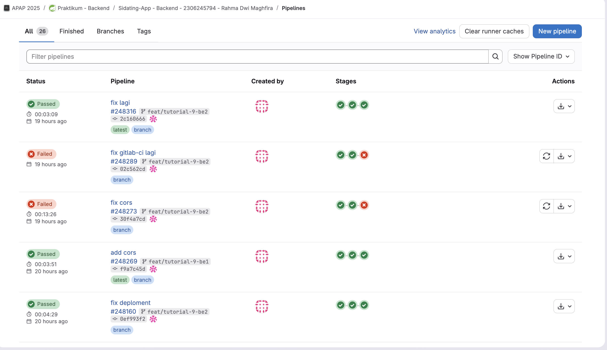 
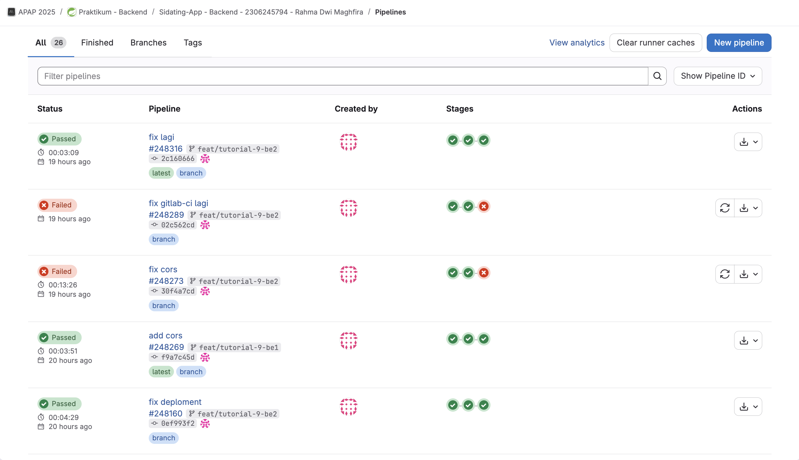 
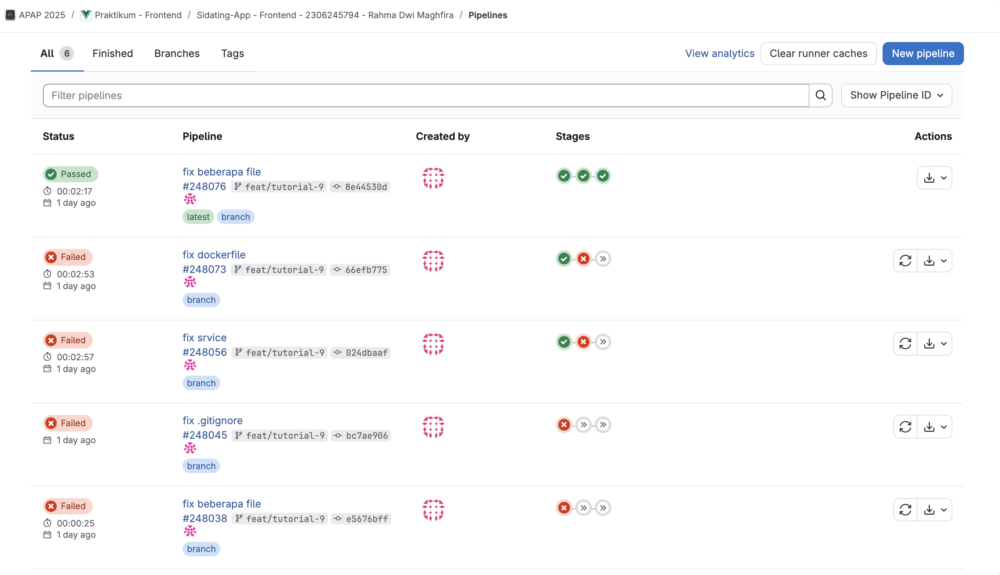 
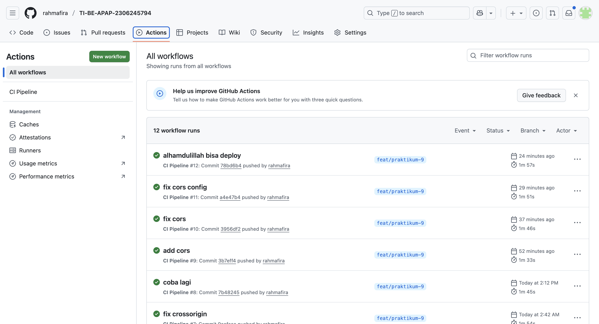 
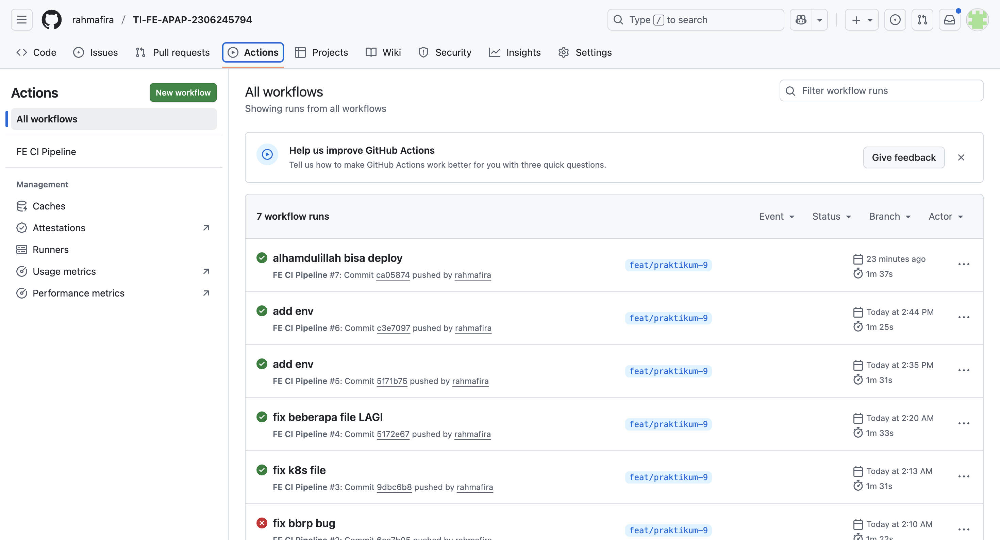 
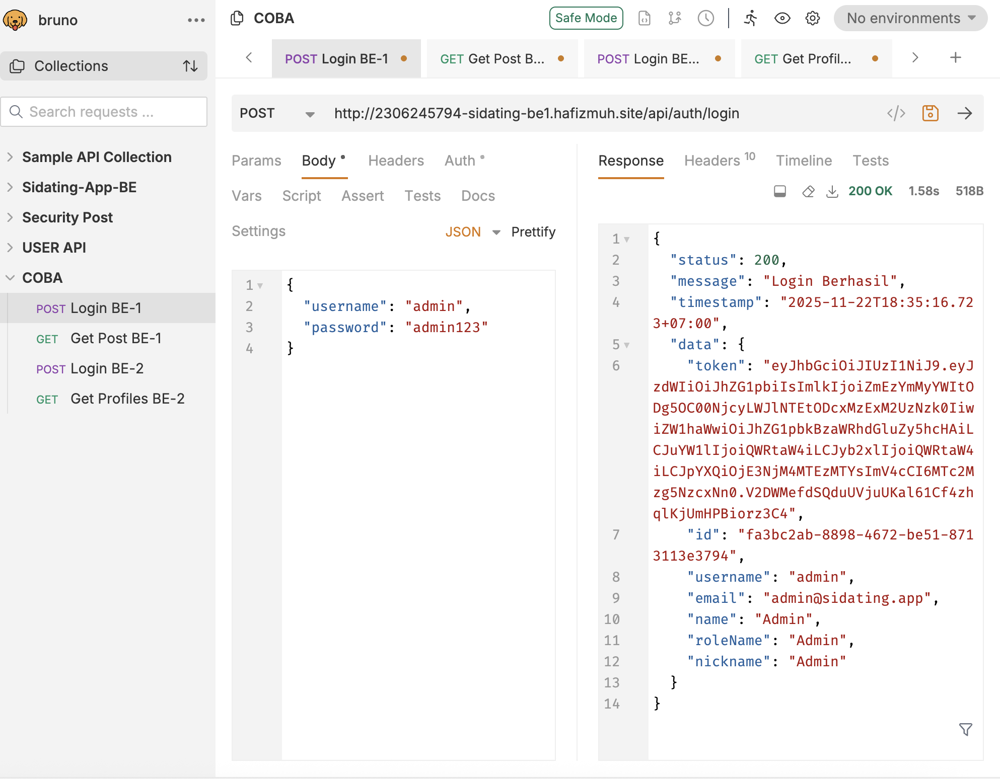 
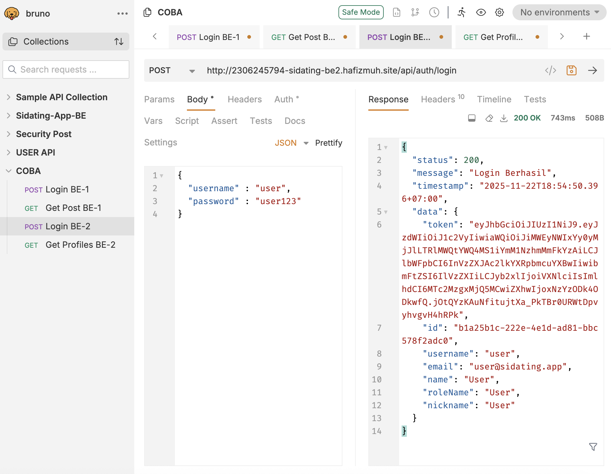 
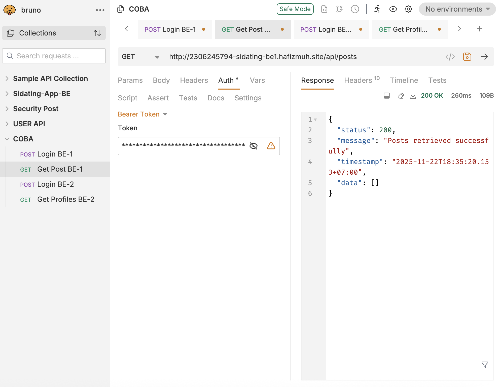 
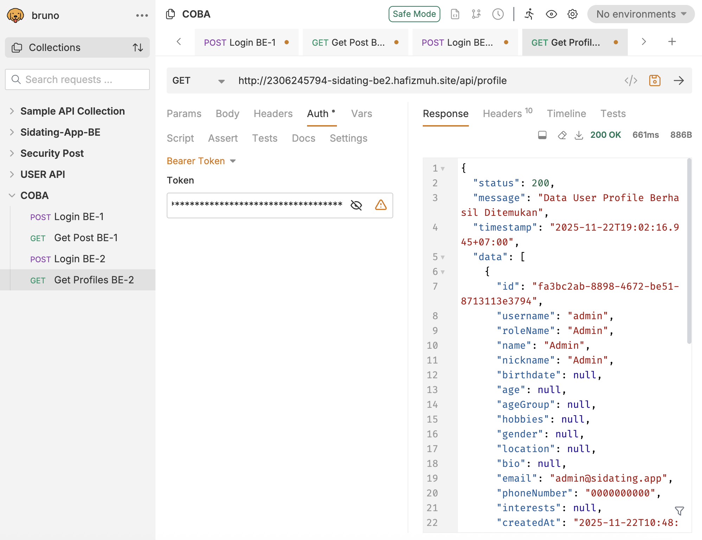 
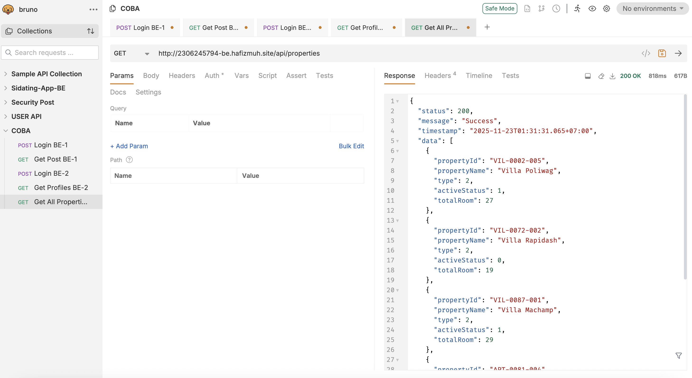 
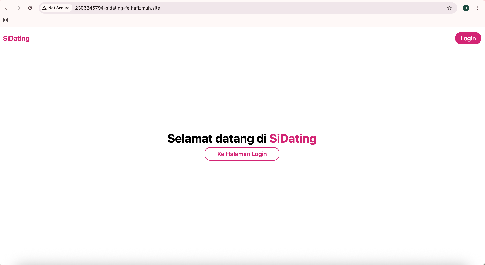 
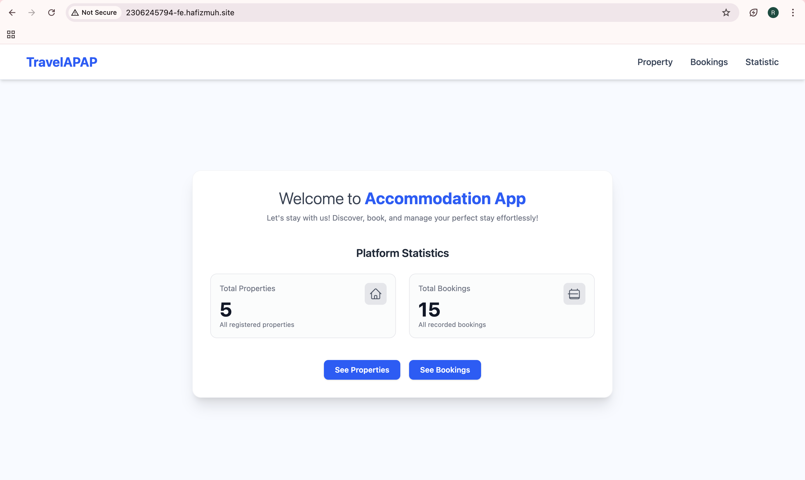 
4. **Pada EC2 instance yang kalian gunakan, kalian diperintahkan untuk mengaitkan dengan Elastic IP. Mengapa demikian? Lalu apa yang terjadi jika kalian tidak mengaitkan instance dengan Elastic IP?** 
Karena AWS Academy akan memastikan instance secara berkala. Saat instance dinyalakan kembali, IP Publik-nya akan berubah jika tidak menggunakan Elastic IP. Jika tidak maka kita harus terus menerus memperbarui konfigurasi IP di sisi client (seperti Frontend atau DBeaver) dan DNS setiap kali server restart, yang akan sangat menghambat proses deployment dan akses aplikasi. 
5. **Apa perbedaan utama dari penggunaan Docker dan Kubernetes pada praktikum ini?** 
Docker diigunakan untuk Containerization, yaitu mengemas aplikasi beserta seluruh dependensinya (seperti JDK) menjadi sebuah image yang portabel, sedangkan Kubernetes (K3s) digunakan untuk Orchestration (Deployment), yaitu mengelola, menjalankan, menjadwalkan, dan memonitor container yang sudah dibuat oleh Docker tersebut di dalam server. 
6. **Dari keseluruhan pipeline yang dibuat, menurutmu proses mana yang paling penting dan mengapa?** 
Continuous Integration (Build & Push). Karena proses ini mengotomatiskan integrasi perubahan kode dari pengembang secara berkala dan memastikan kode dapat dibungkus menjadi artefak yang siap jalan. Tanpa ini, proses deployment akan sangat manual, lambat, dan rentan terhadap human error serta konflik kode. 
7. **Pada konfigurasi kubernetes, sebenarnya kalian menggunakan 5 file konfigurasi 3 pada repository folder k8s dan 2 (secret.yaml & config.yaml) dibuat pada .gitlab-ci.yml. Buatkan penjelasan kegunaan dari kelima file tersebut!** 
- deployment.yaml: Mengatur bagaimana aplikasi dijalankan, termasuk jumlah replika, image yang digunakan, dan resource yang dibutuhkan.
- service.yaml: Berfungsi sebagai penghubung antar komponen dalam cluster (misalnya menghubungkan Ingress ke Pod aplikasi) agar bisa berkomunikasi.
- ingress.yaml: Mengatur akses dari luar (HTTP/HTTPS) agar request dari internet bisa masuk ke layanan yang tepat di dalam cluster (routing domain ke service).
- secret.yaml: Menyimpan data sensitif/rahasia seperti password database, API Key, dan sertifikat TLS secara aman (dienkripsi base64).
- config.yaml (ConfigMap): Menyimpan data konfigurasi yang tidak bersifat rahasia, seperti URL Database atau environment variable umum lainnya. 
8. **Tanpa kalian sadari konfigurasi yang sudah kalian lakukan baik untuk docker database maupun deployment kubernetes sudah menerapkan start on restart, padahal by default docker dan kubernetes tidak menerapkan ini (jika server dimatikan lalu dinyalakan ulang service tetap mati dan harus dinyalakan ulang). Jelaskan dibagian mana sistem start on restart ini kalian terapkan dan bagaimana diterapkannya?** 
- Docker Database: Diterapkan menggunakan flag --restart=always pada command docker update atau konfigurasi restart: always di dalam file docker-compose.yml. Ini memaksa Docker daemon menghidupkan container jika mati.
- Kubernetes: Diterapkan secara otomatis oleh Deployment Controller melalui konfigurasi di deployment.yaml. Kubernetes memiliki fitur self-healing; jika Pod mati atau server restart, Kubernetes akan secara otomatis menjadwalkan dan menghidupkan kembali Pod tersebut untuk memenuhi jumlah replika yang diinginkan (replicas: 1). 
9. **Apa keuntungan dari menerapkan kubernetes pada proses deployment kalian, dibandingkan langsung run image docker saja di server?** 
Keuntungannya adalah fitur self-healing (otomatis restart jika aplikasi crash), kemudahan scaling (menambah/mengurangi jumlah replika dengan mudah), load balancing internal, dan manajemen konfigurasi yang terpusat dan deklaratif (menggunakan file YAML). 
10. **Jelaskan perbedaan antara ketiga tipe service dari kubernetes, yaitu ClusterIP, NodePort dan LoadBalancer? Dan kira-kira mengapa menggunakan ClusterIP merupakan pilihan yang sesuai untuk praktikum ini?** 
- ClusterIP: Hanya mengekspos service di dalam internal cluster (tidak bisa diakses langsung dari internet).
- NodePort: Membuka port spesifik pada setiap IP Node (Server) agar bisa diakses dari luar.
- LoadBalancer: Menggunakan penyedia Load Balancer eksternal (biasanya dari Cloud Provider seperti AWS/GCP) untuk memberi akses IP publik. 
Karena dalam praktikum ini kita menggunakan Ingress Controller (Traefik) sebagai pintu gerbang utama. Service aplikasi cukup menggunakan ClusterIP agar lebih aman (terisolasi) dan hanya bisa diakses melalui rute/domain yang sudah ditentukan oleh Ingress. 
11. **Apa pelajaran terpenting yang kamu dapatkan dari proses deployment otomatis ini, dan bagaimana konsep CI/CD bisa diterapkan pada proyek lain?** 
Otomatisasi adalah kunci efisiensi dan keandalan. CI/CD mengubah proses deployment yang sebelumnya manual, repetitif, dan rentan kesalahan menjadi proses yang cepat, konsisten, dan aman. Konsep ini sangat bisa diterapkan pada proyek lain (seperti proyek KP atau Skripsi) dengan cara membuat skrip pipeline (menggunakan .gitlab-ci.yml, GitHub Actions, atau Jenkins) yang secara otomatis menjalankan tes dan men-deploy aplikasi ke server setiap kali ada perubahan kode (push atau merge request), sehingga tim dapat fokus pada pengembangan fitur.